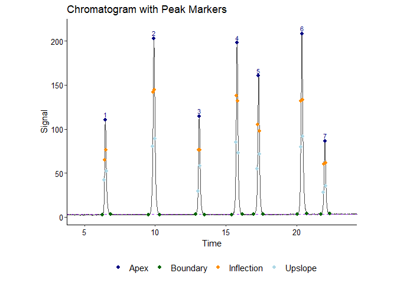
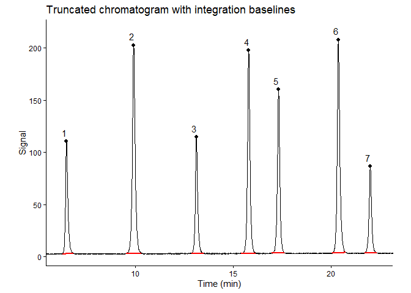
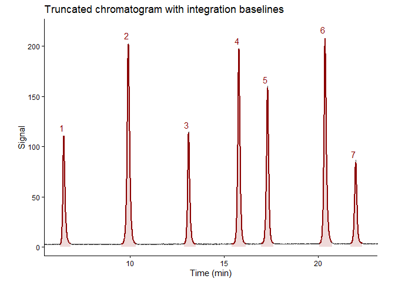
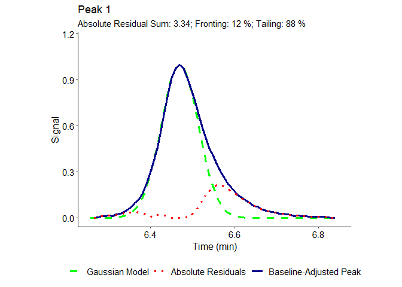

<!-- Useful knitr chunk options -->
<!-- include = FALSE prevents code and results from showing (still runs code) -->
<!-- echo = FALSE prevents code from appearing, but not the results (e.g. figures) -->
<!-- message = FALSE prevents messages that are generated by code from appearing -->
<!-- fig.cap = "" adds caption to graphical resutls (e.g. ggplot) -->
<!-- eval = FALSE prevents code in chunk from running -->
<!-- ALL OPTIONS: https://www.rstudio.com/wp-content/uploads/2015/03/rmarkdown-reference.pdf -->
<!-- README.md is generated from README.Rmd. Please edit that file -->

# lcqc

<!-- badges: start -->
<!-- badges: end -->

## Overview

The abbreviation that forms the title of `lcqc` stands for “liquid
chromatography quality control”. The package is meant as a useful tool
for chromatographic peak detection and analysis to determine various
performance metrics characterizing high-performance liquid
chromatography (HPLC) columns. The workflow of `lcqc` was designed to
proceed via sequential steps, beginning with a one-dimensional
chromatogram consisting of retention time and signal data (e.g. as a
two-column `data.frame`). From this simple input, peaks are
automatically detected, modeled, integrated to obtain peak areas,
analysed for symmetry and other LC-specific metrics, and the results
visualized in the form of accompanying plots and holistic PDF or CSV
reports.

## Installation

Use the following command to install `lcqc` from
[GitHub](https://www.github.com/Deniz-Koseoglu/lcqc):

``` r
install.packages(devtools)
devtools::install_github("Deniz-Koseoglu/lcqc", build_vignettes = TRUE)
```

The package may then be loaded via:

``` r
library(lcqc)
```

The package documentation can be accessed with:

``` r
?lcqc # documentation
```

## Main functions

The main workflow of `lcqc` is supported by the following key functions:

- `chrom_detect`: Automatically detects and classifies chromatoraphic
  peaks, as well as their inflection points, upslope points, and
  boundaries. Additional parameters facilitate chromatogram smoothing,
  baseline correction, peak width detection, and other helpful functions
  prior to peak detection. Peak filtering based on various criteria such
  as the signal-to-noise ratio (S/N) is also implemented. **Peak
  detection is always a sensible (and often necessary) first step of any
  `lcqc` workflow**, since other functions are largely designed to work
  with `chrom_detect` output.

- `chrom_skim`: Draws traditional integration baselines and carries out
  Trapezoidal Rule integration of detected peaks to obtain peak areas.

- `chrom_icf`: A useful alternative (or complementary method) to
  `chrom_skim`. Iteratively models detected peaks and compares the
  results of various curve fitting models on a peak-by-peak basis. The
  modeled peaks are integrated to calculate peak areas.

- `chrom_tplate` Calculates the number of theoretical plates ***N*** and
  other useful metrics such as the reduced plate height ***h*** and
  separation impedance ***E*** for detected peaks.

- `chrom_asym` Assesses peak asymmetry using various well-known metrics
  such as the tailing factor ***T<sub>f</sub>*** and asymmetry factor
  ***A<sub>s</sub>***. Also incorporates Total Peak Analysis (TPA) for a
  more holistic independent assessment of peak fronting and tailing.

- `chrom_retf`, `chrom_sepf`, and `chrom_res` These functions calculate
  retention factors ***k***, separation factors $\boldsymbol{\alpha}$,
  and resolution ***R*** as key metrics of column selectivity
  (separation quality). Since the calculation of ***R*** requires both
  ***k*** and $\boldsymbol{\alpha}$ as input, `chrom_res` alone may be
  used to retrieve all three metrics with certain methods.

## Basic usage

This section provides basic examples of using `lcqc` via HPLC data
embedded into the package. These examples do not illustrate the full
functionality of the package, but instead serve as an introduction to
the main workflow that hopefully facilitates the user experience.
Significantly more extensive examples and detailed explanations of the
algorithms involved are available in the `help()` documentation.

As a first step of working with `lcqc`, the `chrom_detect()` workflow is
used to automatically detect chromatographic peaks. Here, a simulated LC
chromatogram is processed. Peak apices, inflection points, upslope
points, and peak boundaries are visualized alongside the signal
amplitude limit used for detection:

``` r
lc_data <- lcqc::simlc7

invisible({capture.output({
detres <- chrom_detect(lc_data)
})})
detres$results$Peak_Extents
#>   group peak inf_wd    top_pa sn_ratio ptype lb_type rb_type ind_dermax
#> 1     1    1     10  8.340283 18549.90     B       B       B        735
#> 2     2    2     11 17.414705 34079.41     B       B       B       1126
#> 3     3    3     10  8.755227 19214.23     B       B       B       1490
#> 4     4    4     10 15.239191 33196.51     B       B       B       1794
#> 5     5    5     11 13.215274 26848.10     B       B       B       1968
#> 6     6    6     12 18.823780 34974.26     B       B       B       2315
#> 7     7    7     10  6.703017 14488.11     B       B       B       2501
#>   ind_sigmax ind_finmax ind_starts ind_ends ind_lups ind_rups ind_linf ind_rinf
#> 1        736        736        712      779      729      744      731      741
#> 2       1126       1126       1082     1173     1117     1136     1121     1132
#> 3       1491       1491       1462     1534     1481     1498     1486     1496
#> 4       1795       1795       1752     1836     1787     1804     1790     1800
#> 5       1968       1968       1930     2004     1959     1976     1963     1974
#> 6       2316       2316       2280     2358     2307     2325     2310     2322
#> 7       2501       2501       2470     2539     2491     2510     2496     2506
#>   rt_dermax rt_sigmax rt_finmax rt_starts   rt_ends   rt_lups   rt_rups
#> 1  6.460677  6.469479  6.469479  6.258231  6.847966  6.407865  6.539895
#> 2  9.902264  9.902264  9.902264  9.514976 10.315959  9.823046  9.990284
#> 3 13.106197 13.114999 13.114999 12.859740 13.493485 13.026979 13.176613
#> 4 15.782008 15.790810 15.790810 15.412324 16.151693 15.720394 15.870029
#> 5 17.313559 17.313559 17.313559 16.979082 17.630431 17.234340 17.383975
#> 6 20.367857 20.376659 20.376659 20.059787 20.746343 20.297441 20.455877
#> 7 22.005031 22.005031 22.005031 21.732169 22.339508 21.917011 22.084249
#>     rt_linf   rt_rinf
#> 1  6.425469  6.513489
#> 2  9.858254  9.955076
#> 3 13.070989 13.159009
#> 4 15.746800 15.834820
#> 5 17.269549 17.366371
#> 6 20.323847 20.429471
#> 7 21.961021 22.049041
detres$plots$Chromatogram
```



The separated peaks may then be integrated using `chrom_skim` and/or
`chrom_icf` to obtain peak areas:

``` r
invisible({capture.output({
ints <- chrom_skim(detres)
ints_icf <- chrom_icf(detres, modres = TRUE)
})})
ints$plot
```



``` r
ints_icf$modplot$Modeled_Peaks
#> Warning: No shared levels found between `names(values)` of the manual scale and the
#> data's colour values.
#> Warning: No shared levels found between `names(values)` of the manual scale and the
#> data's fill values.
```



Theoretical plates and, optionally, reduced plate height and separation
impedance are calculated via `chrom_tplate`, once again using `detres`
as input:

``` r
tplate <- chrom_tplate(detres, method = c("FW","S5","EP","inf"), show_widths = FALSE)
tplate$results
#>   group peak      N_FW      N_S5      N_EP     N_inf
#> 1     1    1  11607.59  9082.653  17537.34  18862.00
#> 2     2    2  18325.64 14330.859  26659.11  28517.90
#> 3     3    3  45827.87 36102.325  68157.68  72907.26
#> 4     4    4  61867.17 49032.803  91142.27  96693.77
#> 5     5    5  77757.50 61121.393 111975.15 119593.55
#> 6     6    6  87979.22 69338.696 128158.73 136549.93
#> 7     7    7 114856.68 92757.150 166075.70 177109.09
```

Asymmetry metrics and TPA (including visualizations) are calculated via
`chrom_asym`:

``` r
sym <- chrom_asym(detres, tpa_thres = 0.60, show_widths = FALSE)
sym$results
#>   group peak       Tf       As        W60      sigma resid_sum resid_front
#> 1     1    1 1.294854 1.578661 0.09550120 0.03114355  3.340086   0.4066152
#> 2     2    2 1.088339 1.153885 0.11893812 0.03972085  3.426325   1.1732434
#> 3     3    3 1.151964 1.288911 0.09842202 0.03327660  2.853050   0.7087908
#> 4     4    4 1.056594 1.107532 0.10292893 0.03417634  3.020583   1.1790058
#> 5     5    5 1.021420 1.058690 0.10145035 0.03318069  3.056708   1.3721428
#> 6     6    6 1.172221 1.339222 0.11174486 0.03666499  3.535273   0.7876644
#> 7     7    7 1.024062 1.057049 0.10610174 0.03427978  3.254304   1.4172212
#>   resid_back percent_fronting percent_tailing tpa_suitability
#> 1   2.933544         12.17379        87.82840               1
#> 2   2.254884         34.24204        65.81058               1
#> 3   2.145463         24.84327        75.19895               1
#> 4   1.843096         39.03240        61.01789               1
#> 5   1.684917         44.88956        55.12195               1
#> 6   2.750706         22.28016        77.80744               1
#> 7   1.837089         43.54914        56.45107               1
sym$plots[[1]]
```



Additional metrics such as retention factors, separation factors, and/or
resolution may be calculated via `chrom_retf`, `chrom_sepf`, and/or
`chrom_res`:

``` r
t0 <- 0.25 #Sets dead time (i.e. breakthrough time) to 0.25 minutes
retf <- chrom_retf(detres, t0 = t0, t0_mode = "manual")
retf$results
#>   id type        rt   t0        k
#> 1  1    B  6.470013 0.25 24.88005
#> 2  2    B  9.905643 0.25 38.62257
#> 3  3    B 13.112687 0.25 51.45075
#> 4  4    B 15.788143 0.25 62.15257
#> 5  5    B 17.314803 0.25 68.25921
#> 6  6    B 20.372569 0.25 80.49028
#> 7  7    B 22.005209 0.25 87.02084
sepf <- chrom_sepf(detres, ks = c(t0,"manual"))
sepf$results
#>   id1 id2 type1 type2       k1       k2 sep_factor
#> 1   1   2     B     B 24.88005 38.62257   1.552351
#> 2   2   3     B     B 38.62257 51.45075   1.332142
#> 3   3   4     B     B 51.45075 62.15257   1.208001
#> 4   4   5     B     B 62.15257 68.25921   1.098252
#> 5   5   6     B     B 68.25921 80.49028   1.179186
#> 6   6   7     B     B 80.49028 87.02084   1.081135
res <- chrom_res(detres, method = "all", ks = c(t0,"manual"))
res$results
#>   id1 id2 type1 type2       rt1       rt2   res_W0 res_W50_1 res_W50_2
#> 1   1   2     B     B  6.470013  9.905643 5.088308 15.665749 15.672018
#> 2   2   3     B     B  9.905643 13.112687 4.570413 14.442780 14.448559
#> 3   3   4     B     B 13.112687 15.788143 4.013982 13.032663 13.037878
#> 4   4   5     B     B 15.788143 17.314803 2.324276  7.328226  7.331159
#> 5   5   6     B     B 17.314803 20.372569 4.889072 14.054825 14.060449
#> 6   6   7     B     B 20.372569 22.005209 2.650011  7.351827  7.354769
#>   res_seprt
#> 1 25.474803
#> 2 17.963890
#> 3 12.446691
#> 4  6.476076
#> 5 11.024161
#> 6  5.449442
```
